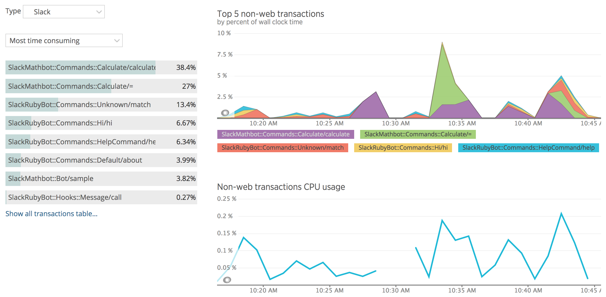
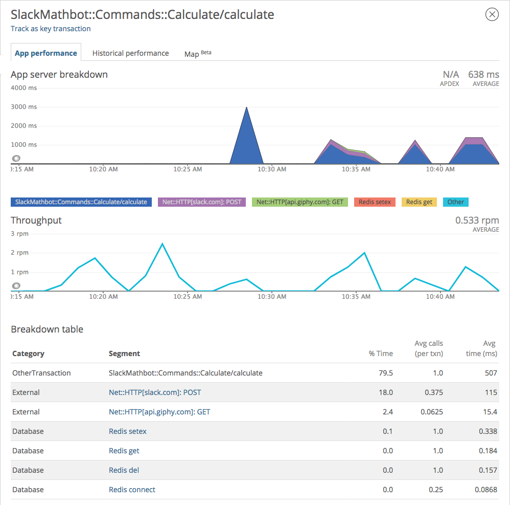

NewRelic Instrumentation for SlackRubyBot
=========================================

[](https://badge.fury.io/rb/newrelic-slack-ruby-bot)
[](https://travis-ci.org/slack-ruby/newrelic-slack-ruby-bot)
[](https://codeclimate.com/github/slack-ruby/newrelic-slack-ruby-bot)

NewRelic instrumentation for [slack-ruby-bot](https://github.com/slack-ruby/slack-ruby-bot).



## Install

Add to Gemfile.

```ruby
gem 'newrelic-slack-ruby-bot'
```

## Usage

This gem adds New Relic tracing to the Slack message hook, which is the start of all messages coming in from Slack.
New Relic will automatically record any external requests made through supported libraries (such as `Net::HTTP`) and database queries for supported databases (such as `MongoDB` and `Redis`).
This gem also adds the team, channel, user, and match data from each message, which can be seen in New Relic transaction traces and Insights.



### Renaming transactions

By default, `newrelic-slack-ruby-bot` names New Relic transactions according to the operator, command, match, or scan route that was called.
To rename a New Relic transaction, make a call directly to the New Relic agent.

```ruby
::NewRelic::Agent.set_transaction_name('new name')
```

The typical format for transaction names is `ClassName/method`.

### Adding custom attributes

You can add additional custom attributes via the New Relic agent.

```ruby
::NewRelic::Agent.add_custom_attributes(key: value)
```

## Contributing

You're encouraged to contribute to this gem. See [CONTRIBUTING](CONTRIBUTING.md) for details.

## Copyright and License

Copyright (c) 2015, Daniel Doubrovkine and [Contributors](CHANGELOG.md).

This project is licensed under the [MIT License](LICENSE.md).
